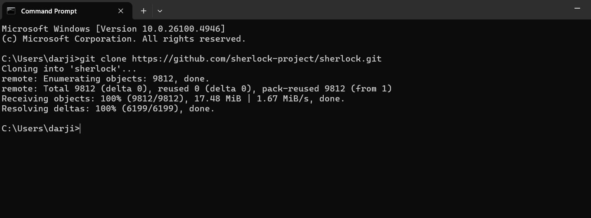

# Cloning an Existing Repository

I used the Git CLI to clone the Sherlock repository from GitHub.

## Command Used
```sh
git clone https://github.com/sherlock-project/sherlock.git
```

## Screenshot of Successful Clone


